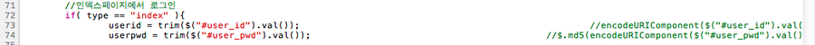
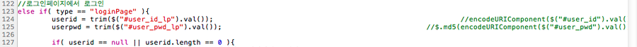

Title: olleh ucloudbiz의 문제는 계속된다.
Time: 02:59:00

얼마 전, olleh ucloudbiz 사이트 로그인 과정에서 특수 문자가 포함된 경우, 정상적인 로그인이 불가능하며, 해당 문자를 포함하지
않게끔 비밀번호를 바꾼 후에는 정상적으로 사용이 가능했다고 글을 남긴 적이 있다. ( 참조 :[http://blog.naver.com/ez_
/140146636414](http://blog.naver.com/ez_/140146636414) )

  

이에 대해 트위터 계정 [@olleh_ucloud](http://twitter.com/#!/olleh_ucloud) 에게 보고하였으며, 그
이후에는 특수 문자가 포함되지 않은 비밀번호로 서비스를 계속 이용해왔다.

헌데, 오늘 가상 서버 청약을 위해 홈페이지 로그인을 시도했는데, 로그인이 되지 않았다.

  

설마하는 생각에 특수 문자를 포함한 예전 비밀번호로 로그인을 시도했더니, 로그인이 된다.

  

정리:

1. 기존에 지적했던 자바스크립트 코드는 변경하다만 흔적만 있는 것으로 보아, 서버쪽에서 값을 전달받은 후에 urldecode를 수행하는
것으로 보인다.

2. olleh ucloudbiz는 사용자의 비밀번호를 '평문'으로 저장하고 있는 것 같다. 그렇지 않고선 예전 비밀번호로 로그인이 가능한
것이 말이 되나? ( 로그인 시도시에 사용하는 사용자명/비밀번호를 평문으로 저장했을 가능성이 높다 )

3. 평문으로 저장하지 않고 해시 값으로 보관한다고 해도, 최소한 사용자의 비밀번호를 멋대로 바꾼 것임에는 틀림 없다.

  

  

ucloudbiz 쪽에서는 내가 비밀번호를 잘못 기억하고 있었거나, 직접 비밀번호를 변경해놓고 잊었다고 얘기할지도 모른다.

서버 로그야 얼마든지 변조할 수 있으므로, 이렇게 적는다 한들 아무런 의미가 없을 수도 있다.

  

어쨌든 그냥 넘어갈 수는 없는 문제.

비밀번호 수정에 대한 이력 증명과 이에 대한 해명을 KT 쪽에 직접 요구할 것이다.

  

  

첨부:

  

수정하다만 흔적이 있는 자바스크립트 코드.portal.login.js, 73~74L, 123~124L

  

