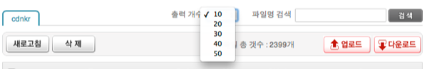

Title: olleh ucloud storage의 문제점
Time: 05:08:00

작년 말부터 고려하던 ucloud biz 서비스는 모두 쓰지 않기로 결정을 내렸지만, 그래도 문제점은 지적해야 할 것 같아서 포스팅해본다.

어쩐지 꼰대 같은 기분이 들지만... 기분탓이겠지.

이제까지 쓴 ucloud 관련 글 모음 :[http://blog.naver.com/PostSearchList.nhn?blogId=ez_&Se
archText=ucloud](http://blog.naver.com/PostSearchList.nhn?blogId=ez_&SearchTex
t=ucloud)

  

  

서비스 해지를 진행하고 탈퇴하려 했지만, 문제 발생.

  1. 탈퇴를 위해서는 모든 서비스를 해지해야 함.
  2. storage 서비스를 해지하려면, 등록된 파일 박스를 모두 삭제해야 함.
  3. 파일 박스를 삭제하려면, 박스 내부의 모든 파일을 삭제해야 함.
  4. 파일이 2,399개임.
  5. 웹 콘솔에서는 한 번에 50개 까지만 지우도록 구성되어 있음. => 48번 반복해서 지워야 함.

  

  

나는 (5)를 받아들일 수가 없어, cloudfuse 마운팅을 통해 박스 내의 파일을 rm 명령어로 손쉽게 삭제하였다.

헌데, 웹 콘솔에서는 여전히 파일이 남아있는 것으로 보여, 파일 박스를 삭제할 수 없는 상황.

  

( 추가로, 파일 명이 길면 ~(tilde)와 확장자로만 표시해서, 정확히 어떤 파일인지 알 수 없게 표시하는 것은 애교 수준. )

  

  

고객센터에 문의하니, 아래와 같이 웹 콘솔에서 50개씩 일일이 지우라는 답변을 받았다.

참고로, cloudfuse를 통한 파일 관리는 ucloud 에서 주장하는 것과는 달리 비교적 정상적이다. 링크 :[http://blog.na
ver.com/ez_/140146580167](http://blog.naver.com/ez_/140146580167)

  

  

  

사람마다 기준이 다르니,고작 삭제 몇 번 반복하는 일이 뭐 귀찮아서 이런 글을 쓰냐 싶은 사람도 있겠지만은,

내 기준에서는 애초에 제대로 된 서비스를 하고자 하는 의지가 별로 없는 것처럼 느껴진다.

  

안녕.

  

  

  

