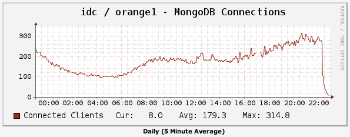

Title: Redis를 이용한 MongoDB 기반 로그 수집기 성능 개선
Time: 01:44:00

Before : MongoDB only

  

PHP + MongoDB로 구성한 로그 시스템을 9개월 정도 사용해왔다.

참고 : PHP에서 MongoDB 사용하기 /[http://blog.naver.com/ez_/140131584342](http://blog.
naver.com/ez_/140131584342)

  

허나, persist 옵션을 이용한 persistent connection을 사용하더래도, 시스템 전체에서 연결을 공유하는 것이 아니라 해당
프로세스 내에서 연결을 공유하는 것이기 때문에, 종종 지나치게 많은 연결에 따른 퍼포먼스 문제가 장애 수준으로 발생하곤 했다.

참고 :[http://www.php.net/manual/en/mongo.construct.php](http://www.php.net/manu
al/en/mongo.construct.php)

  

MongoDB는 - 버전에 따라 다르지만 - INSERT / UPDATE 시에 global write lock을 사용하기 때문에 많은 쓰기
요청이 동시에 발생하면, 첫 쓰기 동작이 끝날 때 까지 나머지는 그저 기다리기만 할 뿐이다.평상시에는 1~200 연결 정도로 별 무리 없이
사용하곤 했지만, 이벤트나 푸시 메세지 전송 등으로 인해 순간적으로 접속이 몰려 500개 이상의 연결이 되기도 할 뿐 아니라, 이를 초과해
MongoDB가 아예 다운되곤 했다. ( 당시 MongoDB 1.6 사용 )2.0 으로 업그레이드하더래도, 이 현상이 크게 개선될 것으로
예상되지는 않았다.

참고 :[http://blog.pythonisito.com/2011/12/mongodbs-write-
lock.html](http://blog.pythonisito.com/2011/12/mongodbs-write-lock.html)

  

정리해보면, 기존 방식은 다음과 같다.

- 로그는 Application / Event 단위로 구분되고, 각 로그는 임의의 컬럼을 가질 수 있는 상태.

- Application / Event 단위의 로그 개수는 INSERT 할 때에 별도의 캐시 DB에 더해 미리 계산.

- Apache httpd + mod_php 로 동작되며, 사용자로부터 전달된 n개의 로그를 보관하는데 n번의 INSERT / UPDATE 가 발생하고 있었음.

  

  

  

  

  

After : With Redis

  

MongoDB는 기본적으로 개별 INSERT 횟수가 많아지면 쓰기 성능이 매우 떨어지므로, 벌크 INSERT가 가능한 쪽으로 수정 방향을
잡았다.

- 로그의 구분 방식과 캐시 DB 구조 자체는 그대로 유지.

- 사용자로부터 로그를 받으면 바로 저장하지 않고 system-wide 한 캐시 프레임워크에 로그를 저장.

- 주기적으로 캐시 프레임워크로부터 로그를 읽어들여 개별 INSERT / UPDATE가 아닌 대단위 벌크 INSERT / UPDATE를 하도록 수정.

  

이 작업에 가장 적합한 것이, LIST 형식을 지원하는 Redis일 것으로 예상했고, 아래와 같이 개선했다.

- 로그를 받아 전처리한 후, Redis에 보관.

- cronjob을 통해 1분 단위로 Redis에 보관되어있던 로그를 MongoDB로 벌크 INSERT.

- Application / Event 단위의 로그 개수 갱신도, 벌크 INSERT 과정에서 통계를 내서 한꺼번에 UPDATE.

  

참고 :Predis, using redis on PHP/[http://blog.naver.com/ez_/140158670703](http:/
/blog.naver.com/ez_/140158670703)

참고 : batchInsert /[http://php.net/manual/en/mongocollection.batchinsert.php](h
ttp://php.net/manual/en/mongocollection.batchinsert.php)

  

  

  

Result

  

Redis를 위해 1MB 정도의 메모리와 약간의 CPU를 더 쓰면서, MongoDB의 연결은 5-6개 수준으로 떨어졌으며, 디스크 사용율도
줄어들었다.

그리고 더 이상의 장애가 발생하지 않게 되었다. 이에 대한 cacti의 스크린샷을 첨부한다.

  

업데이트 이전, 아래와 같이 연결이 500 개가 넘어가면 아예 서버가 뻗기도 했다.

  

Redis 적용 직후 MongoDB 연결 수, 10개 미만으로 하락했다.

  

업데이트 직후, 불필요한 명령어의 호출이 줄어든 모습을 볼 수 있다.

  

Redis가 사용하고 있는 메모리의 양. 현재 위에서 언급했던 로그 서비스만을 위해 가동중이다.

  

  

이제 더 이상 보지 않아도 되는 - 봐서는 안될 - 예전 cacti threshold alarm 메세지들.

