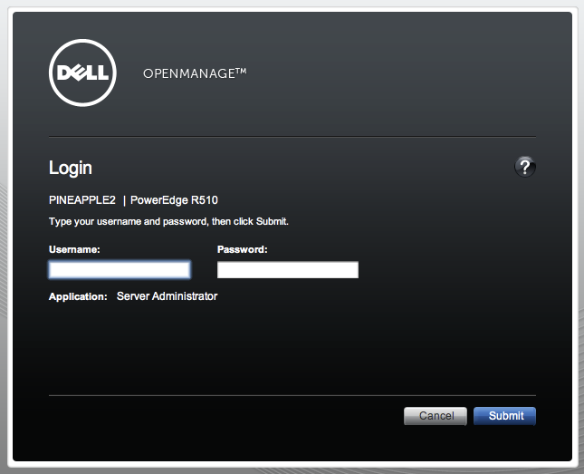
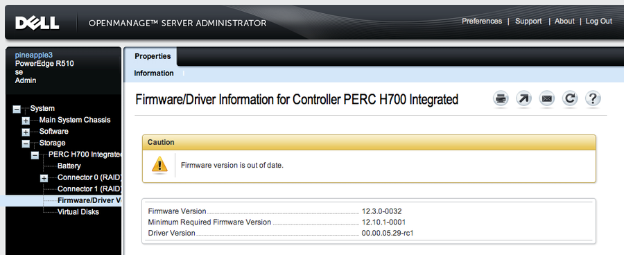
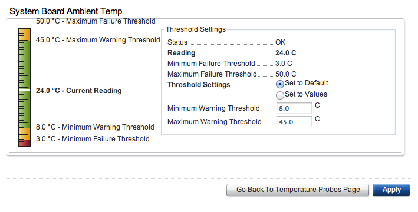
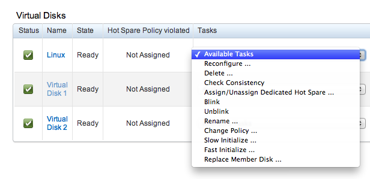

Title: Dell OpenManage Server Administrator on Ubuntu 간략한 설치 후기
Time: 02:31:00

Dell OpenManage on Ubuntu

  

일부 서버에만 설치해 사용하던 Dell OMSA를 본격적인 하드웨어 모니터링을 위해 전체 서버에 설치하게 되어, 간략하게 글을 남겨본다.

아래 링크를 따라 그냥 순서대로 진행하면 막힘 없이 설치 가능하다.

참고 :[http://linux.dell.com/repo/community/deb/latest/](http://linux.dell.com/r
epo/community/deb/latest/)

도움말 링크 :[http://support.dell.com/support/edocs/software/svradmin/7.0/en/index.
htm](http://support.dell.com/support/edocs/software/svradmin/7.0/en/index.htm)

기본 설치 위치는 /opt/dell/srvadmin/ 이다.

  

웹 인터페이스의 기본 포트는 1311 이며, 포트 변경 및 기타 옵션 설정을 원하는 경우 iws.ini 파일을 수정한 후. iws를
재시작한다.

설정 파일 위치 : /opt/dell/srvadmin/etc/openmanage/iws/config/iws.ini

권한 파일 위치 :/opt/dell/srvadmin/etc/omarolemap

IWS 재시작 :sudo service dsm_om_connsvc start

  

Dell 포럼에 OMSA 설치 및 운용에 대한 trouble shooting.

참고 :[http://en.community.dell.com/support-
forums/servers/f/177/p/19350169/20031188.aspx](http://en.community.dell.com
/support-forums/servers/f/177/p/19350169/20031188.aspx)

  

웹 인터페이스의 스크린샷을 첨부한다.

  

  

  

