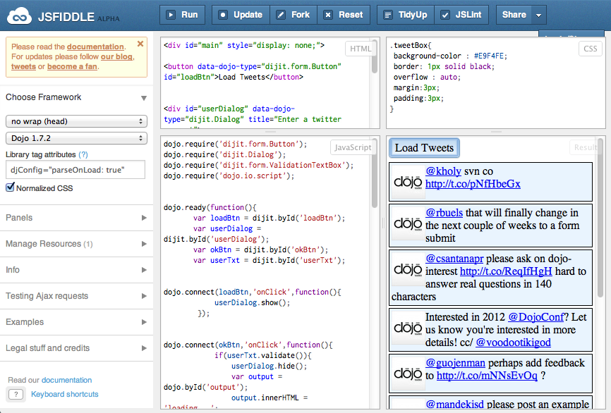
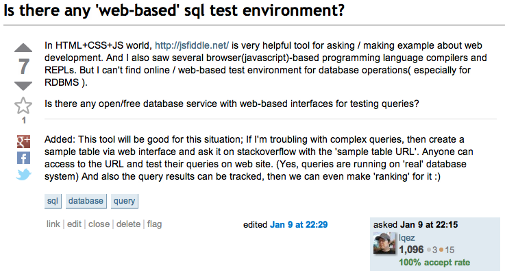
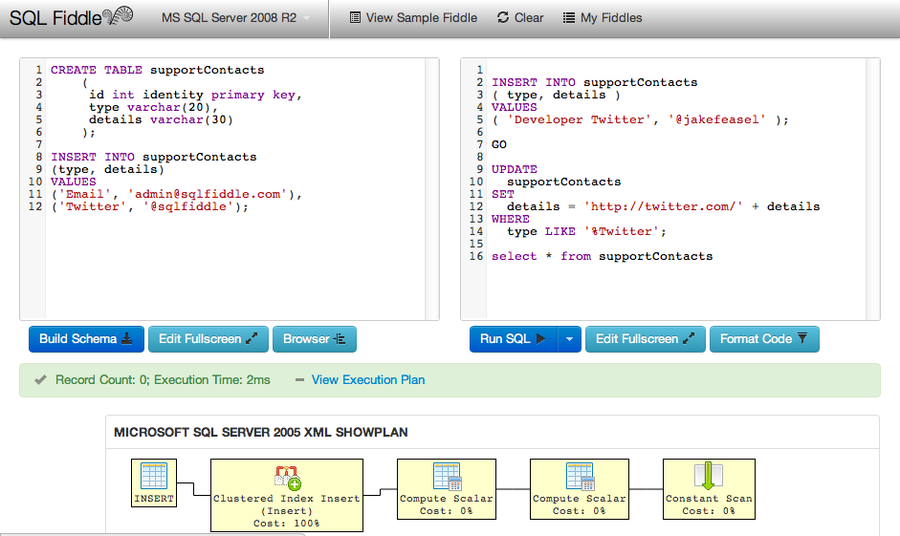
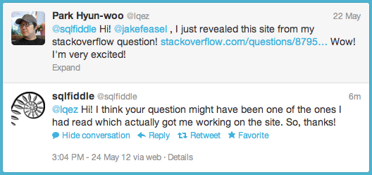

Title: SQL Fiddle
Time: 16:10:00

HTML + CSS + Javascript로 구성된 작은 웹 코드들을 테스트하기에 유용한 jsfiddle이라는 사이트가 있다.

  

[http://jsfiddle.net/](http://jsfiddle.net/)

  

  

이 사이트 덕분에 stackoverflow 등의 질문 사이트에 웹에 관련된 질문을 올리거나 답변하기에 아주 편리해졌는데, SQL과 관련된
질문 답변을 하는 데에는 이와 같은 도구가 없을까 싶어, 올해 초에 stackoverflow에 아래와 같이 질문 글을 올렸다.

링크 :[http://stackoverflow.com/questions/8795913/is-there-any-web-based-sql-
test-environment](http://stackoverflow.com/questions/8795913/is-there-any-web-
based-sql-test-environment)

  

  

그러자 몇 명의 사용자들이 답을 주면서 '그런 사이트 있으면 괜찮을 것 같은데, 만들어봐라' 라는 의견을 주었다.

꿈과 이상은 크지만... 정작 만들 시간이 없어 ( = 능력이 안되서 ) 생각만 하고 만들지는 못했는데, 몇 달이 지난 얼마 전, SQL
Fiddle 이라는 사이트가 있다며 사용해보라는 새로운 답변이 뒤늦게 달렸다. 그래서 방문해보니...

  

[http://sqlfiddle.com/](http://sqlfiddle.com/)

  

**진짜가 나타났다!**

실제로 만들어진 것이 너무 놀라워, 사이트를 뒤져보니 제작자가stackoverflow 사용자일 뿐 아니라, 올해 1월 중순부터 만들기
시작했다는 점도 확인할 수 있었다. 그래서 반가운 마음에 트위터로 멘션을 보냈더니, 다음과 같은 답을 받았다.

  

  

놀라울 따름이다.

내가 무엇인가를 직접 만들지 않아도, 다른이에게 영감을 주거나 자극제가 되어 어떤 '의미있는' 일이 일어날 수 있다는 것.

물론, 그 사람이 꼭 내가 쓴 질문 글 때문에 만든 것은 아니겠지만, 간접적으로나마 영향을 준 것은 사실인 것 같다.

  

아이디어가 있을 때, 그것을 꼭꼭 숨겨두고 혼자만 생각해서는 결과물이 나오기가 어렵다.

작은 아이디어가 있다면 주변 사람들과 공유하고, 발전시키는 과정에서 더 좋은 아이디어도 나오고, 그 아이디어의 구체화도 가능해진다.

  

덧)[http://dbfiddle.net/](http://dbfiddle.net/) 도메인도 사두었는데, 이젠 의욕 상실.github에서
fork 해서 pull request 날리는 것으로 목표 변경. ㅎㅎ

참고 :[https://github.com/jakefeasel/sqlfiddle/](https://github.com/jakefeasel/s
qlfiddle/)

  

