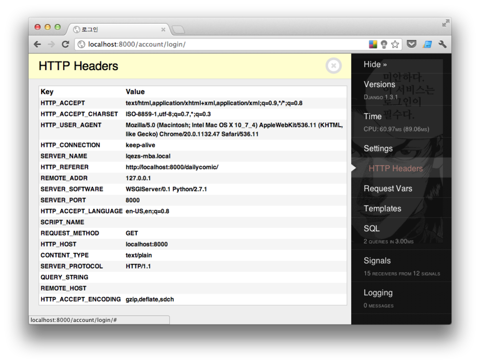
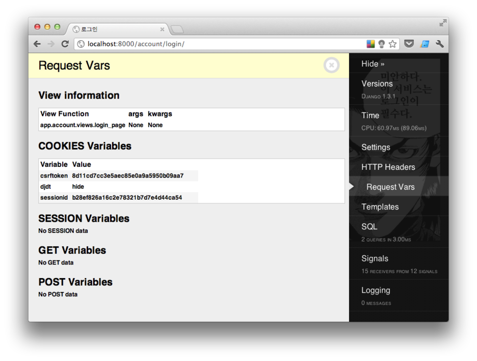
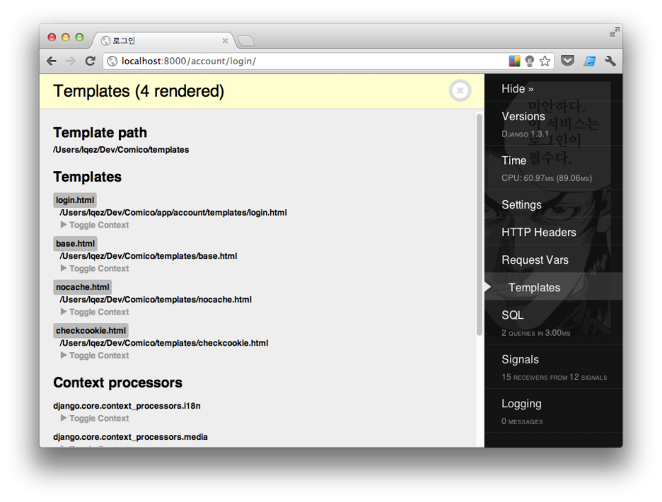
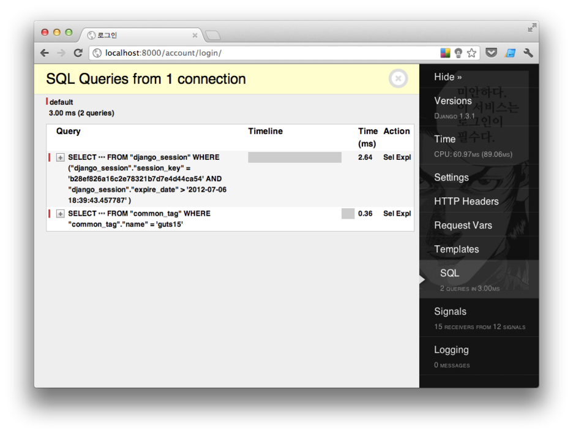

Title: Django debug toolbar
Time: 18:53:00

Prepare

  

Django debug toolbar 는 Django 개발자들의 필수품이라 할 수 있다.

아래의 사용 예에서 보면 알 수 있겠지만, 개발하는데 필요한 대부분의 정보를 툴바를 통해 표시해주기 때문에, 빠른 디버깅과 개발에 도움이
된다.

github 링크 : [https://github.com/django-debug-toolbar/django-debug-
toolbar](https://github.com/django-debug-toolbar/django-debug-toolbar)

  

pip를 통해 django-debug-toolbar 모듈을 설치한다.

> $ pip installdjango-debug-toolbar

virtualenv 를 사용하면 보다 편리한 환경 구성이 가능하므로, 사용하고 있지 않다면 아래 링크를 참조하여 설치한다.

참고 : virtualenv, virtualenvwrapper 설명 / [http://blog.naver.com/ez_/14013862502
1](http://blog.naver.com/ez_/140138625021)

  

  

Configuration

  

github에 있는 도움말을 통해 원하는 대로 툴바를 설정하고 확장할 수 있다.

참고 : [https://github.com/django-debug-toolbar/django-debug-
toolbar#configuration](https://github.com/django-debug-toolbar/django-debug-
toolbar#configuration)

  

사용 중인 설정을 아래에 첨부하였다. 한글로 된 주석 부분은 소스 인코딩 설정에 따라 에러를 발생시킬 수 있으므로, 실 사용시에는 삭제한다.

> # 미들웨어 클래스에 django debug toolbar 추가

>

> MIDDLEWARE_CLASSES += ('debug_toolbar.middleware.DebugToolbarMiddleware',)

>

>

>

> # 설치 앱 항목에 추가

>

> INSTALLED_APPS += ('debug_toolbar',)

>

>

>

> # 툴바를 보여줄 IP를 지정

>

> INTERNAL_IPS = ('127.0.0.1',)

>

>

>

> # 툴바에 표시할 아이템을 지정

>

> DEBUG_TOOLBAR_PANELS = (

>

> 'debug_toolbar.panels.version.VersionDebugPanel',

>

> 'debug_toolbar.panels.timer.TimerDebugPanel',

>

> 'debug_toolbar.panels.settings_vars.SettingsVarsDebugPanel',

>

> 'debug_toolbar.panels.headers.HeaderDebugPanel',

>

> 'debug_toolbar.panels.request_vars.RequestVarsDebugPanel',

>

> 'debug_toolbar.panels.template.TemplateDebugPanel',

>

> 'debug_toolbar.panels.sql.SQLDebugPanel',

>

> 'debug_toolbar.panels.signals.SignalDebugPanel',

>

> 'debug_toolbar.panels.logger.LoggingPanel',

>

> )

추가로 아래와 같은 내용을 설정하여 사용하고 있다.

  

> # 어떠한 클라이언트에서 접속하더래도 툴바를 보여주기 위한 함수

>

> def custom_show_toolbar(request):

>

> return True

>

>

>

> DEBUG_TOOLBAR_CONFIG = {

>

> 'SHOW_TOOLBAR_CALLBACK': custom_show_toolbar, # 툴바 출력 여부를 결정하는 사용자 함수를 지정.

>

> 'INTERCEPT_REDIRECTS': False, # HTTP Redirect 에 대해서 가로채지 말고, 바로 리다이렉트 하도록
한다.

>

> }

  

  

Usage

  

위의 설정을 통해 다음의 내용을 확인할 수 있다.

  * Versions : Django 및 사용중인 Django 모듈들의 버전
  * Time : 페이지를 생성하는데 사용된 CPU 자원
  * Settings : 사용중인 설정 값들
  * HTTP Headers : 요청에 포함된 HTTP 헤더 목록
  * Request Vars : 뷰, 쿠키, 세션 및 GET / POST 항목
  * Template : 페이지 생성에 포함된 템플릿과 컨텍스트 프로세서 목록
  * SQL : 실제 데이터베이스 쿼리 목록
  * Signals : 설정되어 있는 시그널 일람
  * Logging : 출력된 로그 항목

  

  

  

  
  
  
  

  

