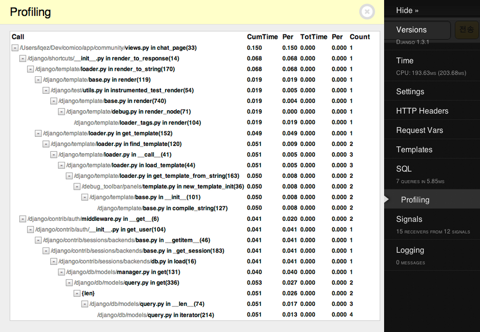
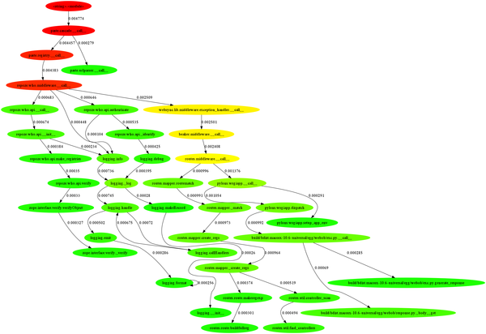

Title: Profiling django
Time: 08:29:00

Django로 편하게 로직을 작성하고 있다 보면, 쾌적한 서비스를 위한 최적화에 대한 노력을 종종 잊게 된다.

중요 릴리즈 포인트나 마일스톤 지점마다 django-debug-toolbar의 SQL 출력 기능과 프로파일링 기능을 활용해 병목 지점을
알아내면 서비스에 큰 도움이 된다.

  

이 글에서는 django-debug-toolbar의 기능 중 하나인 프로파일링 기능을 다루며, Django를 프로파일링 하는 다양한 방법은
다음 장고 문서를 참고한다.

링크 : Profiling Django / [https://code.djangoproject.com/wiki/ProfilingDjango](
https://code.djangoproject.com/wiki/ProfilingDjango)

  

django-debug-toolbar는 cProfile을 이용해 프로파일링을 수행하며, DEBUG_TOOLBAR_PANELS 항목에 해당
모듈을 추가해 간단히 사용 가능하다.

링크 : django-debug-toolbar 설치 및 설정 /[http://blog.naver.com/ez_/140162876100](ht
tp://blog.naver.com/ez_/140162876100)

링크 : Profile modules / [http://docs.python.org/library/profile.html](http://do
cs.python.org/library/profile.html)

  

> DEBUG_TOOLBAR_PANELS = (

>

> ...

>

> 'debug_toolbar.panels.profiling.ProfilingDebugPanel',

>

> )

  

아래는 위의 설정을 통해 프로파일링 결과가 출력된 화면이다.

  

이 외에도 누적된 프로파일링을 통해 전체적인 병목 지점을 파악하고 싶을 때는 linesman 등의 WSGI 프로파일러를 사용하는 것도 도움이
된다. linesman은 graphviz를 이용해 호출 그래프도 출력해주는 기능도 내장하고 있다.

링크 :
[http://pypi.python.org/pypi/linesman](http://pypi.python.org/pypi/linesman)

링크 : 홍민희([@hongminhee](http://twitter.com/hongminhee))님의 linesman 소개 글 /
[http://blog.dahlia.kr/post/8445476650](http://blog.dahlia.kr/post/8445476650)

  

  

linesman에서 생성되는 graphviz callgraph 예제

  

2012-09-04 (추가) 프로파일러 사용시, 뷰가 두 번 호출되는 경우가 있다. 이는 django-debug-toolbar의
버그로,[https://github.com/django-debug-toolbar/django-debug-
toolbar/pull/204](https://github.com/django-debug-toolbar/django-debug-
toolbar/pull/204) 문제이며,[https://github.com/django-debug-toolbar/django-debug-
toolbar/commit/c9d3f34757e6a926dab9b37f33df36c1755ee05c](https://github.com
/django-debug-toolbar/django-debug-
toolbar/commit/c9d3f34757e6a926dab9b37f33df36c1755ee05c) 와 같이 패치되었다. 최신 소스를
클론해서 사용하거나, 해당 부분을 링크와 같이 수정하는 것으로 문제를 해결할 수 있다.

