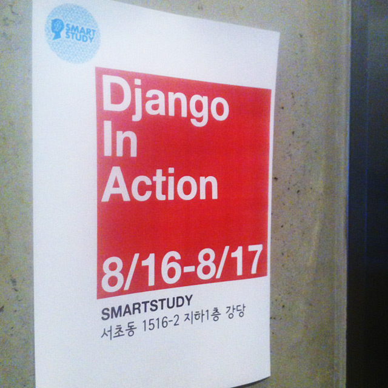
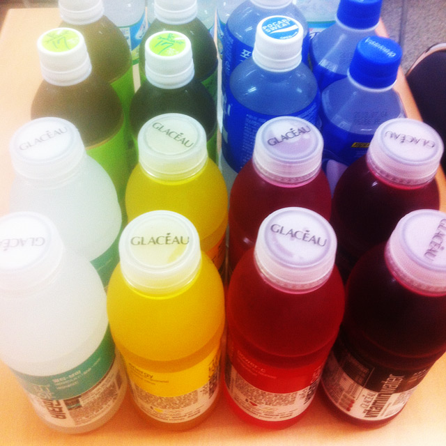
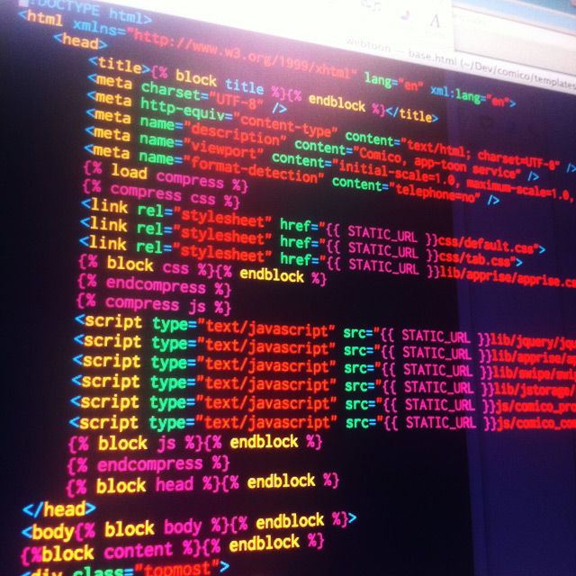
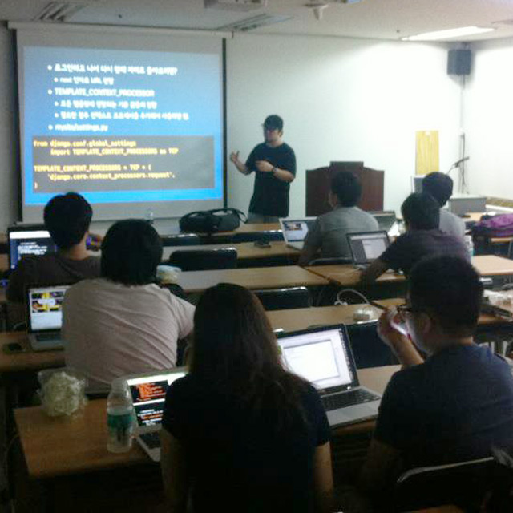

Title: 2012-08-16/17 : 초심자를 위한 Django 오픈 세션 후기
Time: 21:17:00

  

Prologue

  

개발자들을 대상으로 회사를 알리기 위한 방법은 여러가지가 있겠지만, NHN Deview나 KTH H3 등의 행사를 경험한 후에는,회사에서
어떤 일을 어떻게 하고 있는지를 다른 개발자들과 공유하는 것이 좋은 방법 중의 하나라는 생각이 들었다.그래서, 무명인 스마트스터디를
알리려면, 같은 방법으로 개발자를 위한 시간을 가지되,시간과 장소, 비용의 제약이 있으니 어떻게 하면 더 알차고 의미있는 시간을 개발자들과
나눌수 있는지에 대해 고민했다.

  

이 포스트도 네오위즈 개발자 컨퍼런스 2012를 듣다 잠시 나와서 쓰고 있지만,비교적 큰 IT 기업들의 개발자 컨퍼런스를 조금 다녀보니,
공통적으로 느껴지는 아쉬운 점이 있다.

  * 30분 또는 1시간은 너무 '**짧아**' 발표하고자 하는 내용을 다 다루기가 어렵다.
  * (나는 잘 이해할 수 없는) 회사의 보안 사항으로 인해 '**진짜**' 중요한 내용을 얘기하지 못한다.
  * 사정상 발표자와 같이 '**실습**'을 해볼 수 없다는 점이 아쉽다.

  

예전 포스트에도 적었지만, 우리 회사도 각종 애플리케이션 / 서비스의 개발과 운영에 다양한 오픈소스를 사용하는데,'마음' (이라고 적고
'일정'으로 읽는다) 에 여유가 없다보니, 사용하는 프로젝트에 대한 패치를 내는 등의 'giveback'을 못하고 있다.할 수 있는
일이라면, 포스팅을 통해 좋은 프로젝트를 알리거나 이에 대한 스터디를 하는 일이라고 생각해서, 웹 서비스 개발에 사용하고 있는 python
web framework인 django에 대해 오픈 세션을 이틀간 진행해보았다.

  

  

Django In Action

  

키노트 링크 : [http://www.slideshare.net/lqez/smartstudy-
django-201208](http://www.slideshare.net/lqez/smartstudy-django-201208)

페이스북 링크 :[https://www.facebook.com/notes/smartstudy/0/453880547986276](https:/
/www.facebook.com/notes/smartstudy/0/453880547986276)

  

이 세션에서 의도한 점은 다음과 같다.

  1. 개발자의 장비에 Python / django 개발 환경을 갖추어, 돌아간 후에도 지속적인 개발이 가능하도록 유도한다.
  2. Full stack web framework과 Micro web framework 를 비교하여 django의 장단점을 알려준다.
  3. 실제 프로젝트와 유사한 실습 내용을 마련하여, 실습 과정에서 자연스럽게 django를 알아가도록 한다.

  

  

  

Postmortem

  

**(1) 세션 참석자의 PC에 환경을 구축해주기는 생각보다 어렵다!**

Python 설치부터 시작하여, setuptools, pip, virtualenv, virtualenvwrapper 그리고 django까지
설치하는 것이 첫번째 목표였는데, 생각보다 힘들었다. 일단 나부터 Windows에서 Python을 제대로 사용해본 적이 없어, 여러가지
환경에 대응하기 어려울 것으로 생각했는데, 역시나 64bit Windows 에 대한 대응을 제대로 못해서 힘들었다. 다행히 어려운 문제가
아니라 둘째 날엔 바로 키노트에 반영하여 문제를 해결하였다. 헌데, 의외로 OS X 에서의 설치가 까다로웠는데, 다음과 같은 문제가 있어
첫날 제대로 대응하지 못한 문제가 있었다.

  

  * 지나치게 낮은 버전의 Python이 설치되어 있다.
  * 잘못된 sudo로 인해, 설치 대상 폴더의 권한이 예상과 달랐다.
  * OS X Lion에 pre-shipping된 일부 파이썬 모듈에 __init__.py 가 생략되어 있어 정상 동작이 안되었다.

  

이렇게 기본 환경을 구축하는 데에 시간을 소비하고 나니, 이후에 만든 실습을 밤 11시까지 했음에도 불구하고, 끝까지 진행하지 못했다.
그나마 둘째 날에는설치에서의 문제를 대부분 해결한 키노트로 설치 시간을 단축했고, 실습에서도 일부 요소를 정리하여 보다 많은 분량을 진행할
수 있어 아쉬움을 덜었다.

  

차라리 리눅스 VM 이미지 등을 제공하거나, 리눅스 서버의 계정을 발급해서 진행하는건 어떻겠냐는 의견도 있었지만, VM을 주더라도 애초에
리눅스를 사용하던 사람이 아니라면 익숙하지 않은 환경에서 작업하는 것이 더 어려울 것 같고, 계정 발급 방식은 이후에 다시 해보고 싶어도
본인이 직접 환경을 구축하는 일이 어려워 시도를 안하게 될까봐 선택하지 않았다.

  

**(2) 오탈자**

다른 사람이 작성한 슬라이드의 튜토리얼 등을 따라하다 보면, 의외로 오탈자가 많아 왜 이런것도 제대로 하지 못했나 싶을 때가 많았는데, 정작
내가 만든 실습 문서도 오탈자가 있을 뿐 아니라 빠진 페이지도 있어, 참석한 분들을 무척 힘들게 만들었다. 앞으로의 세션에서는 사내 클로즈
베타를 꼭 진행해서 이런 문제를 사전에 잡아야겠다는 생각이 들었다.

  

**(3) 참석 대상자**

기본적으로는 Python / django 초심자분들을 대상으로 하였지만, 몇몇 분들은 Python 환경이나 django에 익숙한 관계로
지루한 실습 세션을 진행한 것으로 예상된다. 앞으로 새로운 세션을 진행할 때에는 대상자를 보다 명확히하여, 참석한 모든 분들에게 조금이나마
필요한 정보를 공유할 수 있도록 해야겠다.

  

**(4) 장소 / 시간**

회사가 지하철 역으로부터 다소 떨어진 곳에 있어 참석자분들이 찾아오기가 수월치는 않았을 것 같다. 원래는 지인 두 세분과 함께 사무실 원탁에
앉아 같이 코딩하면서 django를 알려드리려고 시작한 것이, 예상외로 커져 급하게 장소를 섭외하다 보니 사무실 지하 강당에서 진행하게
되었다. 세션이 조금 일찍 끝났으면 올라와 근무 환경도 보여드리고 사무실 내에서 뒤풀이도 좀 더 많은 분들과 진행했으면 좋았을텐데, 실습
시간이 길어져 자리를 같이 하지 못한 것이 아쉽다.

  

**(5) 기타**

석식으로 샌드위치와 음료를 준비했는데 예상보다 세션이 길어져 늦게 끝나다보니, 좀 더 많은 음료와 부식거리가 필요하지 않았나 하는 생각이
든다. 그리고 기본 발표 이후에 실습은 4-5명 정도가 조를 짜서 같이 진행해보는 것도 좋을 것 같다. 세션을 진행하는데 비용은 다음과 같이
소요되었다.

  

8/16(목) : 샌드위치 76,000원 + 음료 25,160원 + 뒤풀이 19,790원

8/17(금) : 샌드위치 60,800원 + 음료 28,390원

= 총210,140원

  

장소나 장비 대여 비용, 인건비 등이 없어 상대적으로 저렴하게 행사를 진행할 수 있었다.

  

  

Outro

  

위에서 적었듯, 대기업이 진행하는 오픈 컨퍼런스도 의미가 있지만, 수백 명이 참석했을 때 할 수 있는 내용과 십 수명이 있을 때 할 수
있는살가운(?) 세션은 다르다고 생각한다. 앞으로도 '우리는 이런 거 써봤어요'가 아닌, '우리 같이 해봐요'의 보다 실속있는 세션을
진행하고 싶다.

  

마지막으로, 무상으로! 많은 도움을 주신 고마운 분들이 있어 세션을 잘 진행할 수 있었다.

키노트를 검토하고 오류를 지적해주신 박준철([@joongom](https://twitter.com/joongom))님

맨투맨으로 붙어 참석자분들을 도와주신 손동우([@neoevoke](https://twitter.com/neoevoke))님

  

여러가지로 부족한 세션에 참석해주신 분들 모두 감사합니다.

  

덧) 스마트스터디 페이스북 페이지를 통해 오픈 세션에 대한 안내를 할 예정이니, 관심있으신 분들은 페이스북 페이지를 방문하여 Like를
눌러주세요. :)

스마트스터디 페이스북 페이지 링크 :
[http://www.facebook.com/SmartStudyKR](http://www.facebook.com/SmartStudyKR)

  

