Title: 2012-09-10 :  6시 무협 만화 서비스 간략 오픈 후기
Time: 23:40:00

두번째 만화 서비스를 오픈하며,지난 4월에 작성했던 서비스 오픈 후기에 덧붙여간략한 후기 글을 남겨본다.

스마트스터디 박현우([@lqez](http://twitter.com/lqez)) /
[ez@smartstudy.co.kr](mailto:ez@smartstudy.co.kr)

링크 : 만화 서비스 오픈 후기 /[http://blog.naver.com/ez_/140157300770](http://blog.naver.
com/ez_/140157300770)

  

  

Infrastructures

  

Backend, 2 in 1

서버 장비나 네트워크 장비를 추가하지 않고, 기존 장비에 신규 서비스를 바로 얹었다. cacti를 통해 하드웨어 사용에 대한 모니터링을
꾸준히 하고 있었던 덕에 기존 장비의 가동률이 피크시에도 쿼드 코어 장비에서 하나의 코어 정도만 사용하는 수준임을 알고 있어, 별도의 장비를
추가하지 않고 서비스를 추가했다. 물론, 어디까지나 서비스가 폭발적으로 성공하지 않은 탓에 가능한 일이지만 - 필요한 경우 IDC의 장비를
바로 리스할 수 있어, 짧은 시간내에 대처할 수 있기에 선택한 방향이기도 하다.

  

패키지 파일 전달은이전과 마찬가지로 GS네오텍의 CDN 서비스로 이용하고 있고, 요청한 도메인에 따라 서로 다른 루트 디렉토리를 지정할 수
있게 매핑하는 것으로 서비스 준비가 간단히 끝났다. 5분 단위로 전송량 / 세션 수를 확인할 수 있고, 파일이나 디렉토리 단위로 요청 수나
총 전송량도 확인할 수 있다.

  

CDN을 사용하지만 여전히 서버에서 직접 내려보내는 파일이 있는데, (1) IDC는 어차피 예약한 트래픽을 채우지 않아도 예약한 만큼의
비용을 지불해야 하니, 너무 안 쓰면 아까운 면이 있고, (2) 소스 서버로부터 CDN 서버로의 동기화시, 새로운 파일인 경우 외부에서
파일을 요청함과 동시에 동기화가 시작되고, 변경된 파일의 경우에는 5분 내에 동기화가 이루어진다고는 하나,해당 파일이 완전히 동기화 되었는지
확인하는 API가 없어, 중요한 버전 정보 등을 담고 있는 파일은 아직 IDC에서 직접 내려보내고 있다.

  

다른 서비스를 위해 사용하고 있는 AWS의 S3 + Cloudfront 의 조합에서는 특정 파일들에 대한 invalidation
ticket을 API로 요청하여 생성 후 확인이 가능하고, s3cmd의 동기화 명령어를 사용하게 되면 경우 파일 전송과 동시에 자동으로
티켓까지 발행하는 것에 비해, GS네오텍의 CDN 서비스는 이런 부분이 없는 것이 단점이라 할 수 있겠다.

링크 :[http://aws.amazon.com/about-aws/whats-new/2010/08/31/cloudfront-adds-
invalidation-feature/](http://aws.amazon.com/about-aws/whats-new/2010/08/31
/cloudfront-adds-invalidation-feature/)

링크 :[http://s3tools.org/s3cmd-110b2-released](http://s3tools.org/s3cmd-
110b2-released)

  

또한, 파일에 대한 GET 요청에 대응하기 위해 varnish나 squid 등의 별도 캐시 서버는 두고 있지 않은데, 이는 정적 파일에
대해서 nginx가 충분한 캐시 서버 역할이 가능하다고 보기 때문이다.

링크 : [http://todsul.com/nginx-varnish](http://todsul.com/nginx-varnish)

링크 :[http://go2linux.garron.me/linux/2011/04/nginx-varnish-compared-
nginx-941](http://go2linux.garron.me/linux/2011/04/nginx-varnish-compared-
nginx-941)

  

  

SSL Certificate

웹 서버의 SSL 인증서를 처음으로 GoDaddy에서 구입해봤는데, 5개까지의 서브도메인을 지원하는 2년짜리 웹 서버용 SSL 인증서를 약
$160 에 구매했다. 인증서를 직접 구매하지 않던 시절에는 담당자가 가비아나 후이즈 등의 국내 대행 사이트에서 구매했던 것 같은데, 왜
그랬나 싶다. 당연하지만, GoDaddy 인증서로도 대부분의 PC 브라우저와 모바일 기기에서 문제 없이 HTTPS 서비스가 가능하다.
참고로, 서브도메인 없이 1개 도메인만 지원하는 1년짜리 인증서를 대부분 10만원에서 비싼 곳은 40여만원 이상을 받고 있다. 멀티 도메인
가격은 언급하기가 무서울 정도.

링크 :[http://www.godaddy.com/ssl/](http://www.godaddy.com/ssl/)

링크 :[http://serverfault.com/questions/4834/good-low-cost-ssl-certificate-
providers](http://serverfault.com/questions/4834/good-low-cost-ssl-
certificate-providers)

  

MongoDB

애증의 MongoDB는 하드웨어의 증설 없이는 대체품이 없는 관계로, 버전업만 하여 계속 사용중. 2.0으로 업그레이드하면서 불필요한
인덱스를 제거하여 용량을 1/3 까지 낮춰 부담을 줄였다. 현재 약 9억 3천만건의 로그를 마스터-슬레이브x2 의 리플리케이션으로 보관하며,
리플리케이션 서버중 한 대를 통계 작업을 위해 사용하고 있다.

링크 : MongoDB 업그레이드시 주의할 점 /
[http://blog.naver.com/ez_/1401650712](http://blog.naver.com/ez_/140165071269)

  

아래는 MongoDB를 통해 수집한 JSON 데이터를 MySQL에 넣은 뒤 가공하여 만든 사내 시스템의 스크린샷. (대표이사가 직접 개발!)

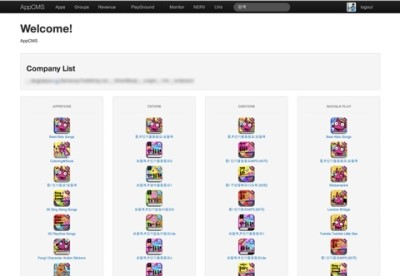

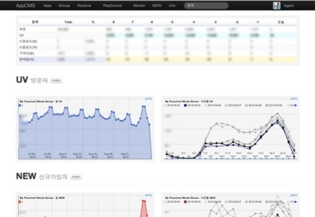

앱 리스트

UV 및 신규 가입

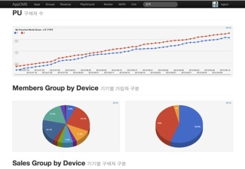

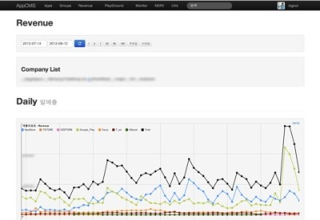

가입자 / 구매자 분포

매출

  

  

Cacti

지난 번 서비스 오픈 이후 별다른 변경 없이, redis 모니터링과 syslog 모듈을 추가하여 사용하고 있다. redis 모니터링
플러그인도 MySQL 등의 모니터링 플러그인을 제공하는 Percona monitoring plugin에 포함되어 있다. syslog 모듈은
원격지 서버에서 구동중인 rsyslog 서비스를 통해, cacti가 설치되어 있는 서버로 모든 syslog를 수집하여, 트리거를 통해
이벤트를 발생시킬 수 있다.

링크 :[http://www.percona.com/software/percona-monitoring-
plugins/](http://www.percona.com/software/percona-monitoring-plugins/)

링크 :[http://docs.cacti.net/plugin:syslog](http://docs.cacti.net/plugin:syslog)

  

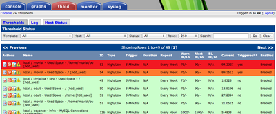

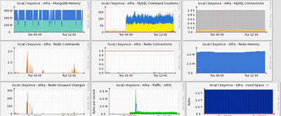

Threshold 플러그인

Redis 및 기타 그래프

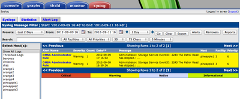

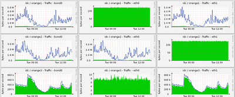

Syslog 플러그인

본딩된 네트워크 상태 모니터링

  

  

Redmine

사내에서 자체적으로 개발하여 운용하고 있는 이슈 트래킹 시스템도 있지만, 리포지터리와 연결되어 동작하는 이슈 트래커는 아닌 관계로
Redmine을 병행하여 사용하고 있었는데, 이번 서비스 런칭에 본격적으로 사용해보았다. Trac을 주로 쓰던 시절, 여러 리포지터리를
지원하지 않아 불편하던차에 Redmine을 알게 된 이후, 종종 사용하고 있다. 스타일/테마를 살짝 손보고, 몇 가지 플러그인만 설치해서
사용중.

링크 :[http://www.redmine.org/](http://www.redmine.org/)

  * Code Review plugin /[http://www.r-labs.org/projects/show/codereview](http://www.r-labs.org/projects/show/codereview)
  * Graphs plugin /[http://www.redmine.org/projects/redmine/wiki/PluginGraphs](http://www.redmine.org/projects/redmine/wiki/PluginGraphs)
  * Light Box plugin /[https://github.com/zipme/redmine_lightbox](https://github.com/zipme/redmine_lightbox)
  * Local Avatars plugin /[http://www.redmine.org/plugins/redmine_local_avatars](http://www.redmine.org/plugins/redmine_local_avatars)

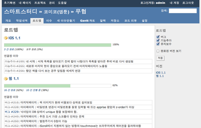

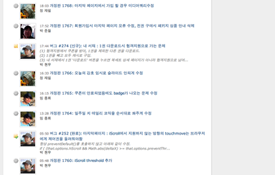

로드맵 & 이슈 표시

최근 변경 사항

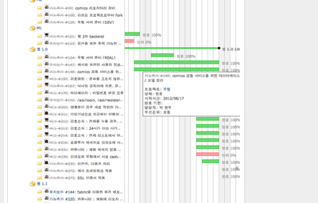

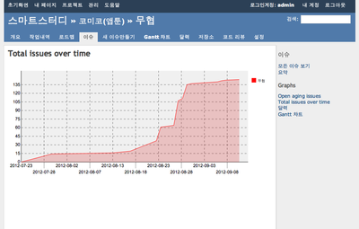

간트 차트

Graph 플러그인

  

Django, again

  

django 1.4에 추가된 기능들 중, (1) Selenium을 통한 브라우저 테스트 프레임워크 추가 (2) 향상된 패스워드 해싱 (3)
prefetch_related() 등을 활용해볼까 싶어 판올림했다. 아직 적용해보진 못했지만 prefetch_related 기능을 통해
향상되는 부분이 있을 것으로 보인다.

링크 : Django 1.4 릴리즈 노트 요약 / [http://blog.naver.com/ez_/140163337352](http://bl
og.naver.com/ez_/140163337352)

  

새로운 서비스지만 같은 만화 서비스이다 보니 겹치는 부분이 있어, django의 백엔드 - 즉, 파이썬 코드는 80% 정도 재활용 했고,
프론트엔드 - CSS, HTML 은 대부분 새로 만들었지만, 모바일 웹 페이지 서비스에 발생하는 여러가지 이슈를 지난 번에 경험한 덕에, 큰
무리 없이 작업할 수 있었다. 막간을 이용하여 vim을 위한 스크립트를 작성하기도 했고, 회사에 개발자들을 초청해 django 실습 세션도
열어보았다. 앞으로 이러한 오픈 세션을 지속적으로 열어, 다른 개발자들과 소통할 수 있는 기회를 마련하고자 한다.

링크 : Django with vim /[http://blog.naver.com/ez_/140163030422](http://blog.nav
er.com/ez_/140163030422)

링크 : 초심자를 위한 Django 오픈 세션 후기 /[http://blog.naver.com/ez_/140166283139](http://
blog.naver.com/ez_/140166283139)

  

Cache with Redis

Redis를 다른 비지니스 로직에도 적극 활용하게 되면서, django cache backend도 memcached에서 redis로 옮기게
되었다. 일단 하나의 redis 서버상에서도 최대 16개까지의 데이터베이스를 사용할 수 있어, 서비스별로 각자의 영역을 침범하지 않고
FLUSHDB 등을 수행하며 자유롭게 쓸 수 있는 점이 마음에 들었다. 다만, RDBMS와 같이 데이터베이스 이름을 문자열로 지정할 수 없고
0~15의 숫자로만 지정해야하는 점이 아쉽다. 더불어, redis용 캐시 백엔드가 아직도 공식 리포지터리에 등록되어 있지 않아, 별도로
설치해서 사용하고 있다.

링크 :[https://github.com/sebleier/django-redis-
cache](https://github.com/sebleier/django-redis-cache)

  

예전 후기글에서, 캐시를 생성할 때 기본으로 제공하는 vary_on_ 계열 데코레이터로는 대응하기 어려운 경우가 대부분이라고 했는데, 여전한
상태. 또한 "(1) 캐시가 expire 된다 (2) 동일한 요청이 수 십개 들어온다 (3) 캐시가 없으므로 여러 요청이 오래 걸리는 연산
과정을 동시에 수행한다 (4) 순간적으로 느려진다는 문제" 로 지적한 부분도 여전한데, 얕은 꼼수를 부려 일단 동일한 캐시를 여러
인스턴스에서 동시에 생성하려는 시도는 많이 줄였다.

링크 : doublecache for django cache framework
/[https://gist.github.com/3656474](https://gist.github.com/3656474)

  

compressor의 경우, 예전엔  나 를 통해 하위 템플릿에서 컴프레싱 하고자 하는
파일을 추가할 수 있도록 작업했었는데, 이렇게 사용하는 것이 효율을 높이지 못했다. 이렇게 작업하면 페이지에서 하나의 js와 css를 받긴
하지만, 매 페이지마다 서로 다른 js와 css 결과물을 받아, 결과적으로는 compressor를 쓰지 않은 경우보다 더 많은 용량을
내려받는 셈이 된다. 따라서, 여러 페이지에서 공통으로 자주 사용하는 js와 css를 골라 compressor 대상으로 하고, 하위
템플릿에서 추가로 필요한 js나 css 파일이 있는 경우, 개별적으로 받도록 하는 것이 낫다. 예를 들어, jQuery와 관련된 다양한
플러그인들은 다양한 페이지에 걸쳐 사용하고 있으므로, 모두 넣어 압축하도록 수정하였다.

  

  

Database with South

유사 서비스가 앞으로 계속 늘어날 것이므로, 이번 작업에서 사용자 가입 / 인증과 관련된 부분을 별도의 앱으로 분리하고, 스마트스터디 계정
시스템을 제대로 만들어두는 편이 좋았을 것이라 생각되지만, 일단은 데이터베이스를 공유하는 형태로 운용하고 있다.

링크 :Django Cross-database relationship 제한 회피하기 / [http://blog.naver.com/ez_/14
0164805705](http://blog.naver.com/ez_/140164805705)

  

모델에 변경사항이 있는 경우 South를 사용했는데, schemamigration / datamigration 을 나눠 편리하게 작업
가능하다. 기존에 늘 SQL 쿼리로 직접 마이그레이션을 하던 때와는 달리 ORM을 통해 SQL 구문이나 특정 DB 벤더의 명령어를 잘 몰라도
마이그레이션이 가능한 점은 장점이나, INSERT INTO [new_table] SELECT ... FROM [old_table] 등의 단순
데이터 변환은 ORM을 통해 오브젝트 단위로 마이그레이션을 수행할 경우 상대적으로 너무 느리다. 또한, 많은 ROW를 담고 있는 테이블에
ORM을 통해 필드를 여러 개 추가하는 경우, ALTER TABLE이 여러 번 수행되어 지나치게 오랜 시간이 걸릴 수 있다. 이런 경우,
(1) schemamigration 만 수행하고, (2) 실제 테이블 변경은 SQL 구문으로 한 번에 처리, (3) --fake 옵션으로
migrate 하는 방식으로 처리할 수 있다.이번에도 ORM을 통한 마이그레이션과, 일반 쿼리로 작성한 마이그레이션을 결합하여 사용하였다.

링크 : South 설치 및 사용기 /
[http://jcstyle.tistory.com/230](http://jcstyle.tistory.com/230)

  

  

CSS with Media queries

기존에는 작업량을 최소화 하기 위해 CSS에 미디어 쿼리 사용을 자제하는 편이었다. 내부에 CSS 전문가가 없기도 했거니와, 일단 스마트폰에
비해 사용자가 많지 않은 패드 / 태블릿 기기를 위해 별도의 작업은 자제했다. 헌데, 패드나 태블릿 기기 사용자의 결제율이 폰 사용자에 비해
높은 편임을 알게 되었고, 마침 프론트엔드 전문 엔지니어가 팀에 합류한 덕에 미디어 쿼리를 적극 활용하여 액정이 큰 기기에서 기존 서비스에
비해 꽤 괜찮은 화면을 보여줄 수 있게 되었다. 단, 아직 미디어 쿼리 적용 화면 크기 기준이 불명확한 관계로, LESS
framework이나 Twitter bootstrap 에서 정의한 구분 단위와 유사한 기준을 선택해, 앞으로의 작업에 적용할 예정이다.

링크 : LESS framework /[http://lessframework.com/](http://lessframework.com/)

링크 : Twitter Bootstrap
/[http://twitter.github.com/bootstrap/](http://twitter.github.com/bootstrap/)

  

- 만화 서비스 초기작 -

미디어 쿼리가 충분히 적용되지 않아 어설픈 화면을 보여주고 있다.

- 미디어 쿼리 적용 후 -

미디어 쿼리를 통해 패드나 태블릿에서도 높은 퀄리티를 유지할 수 있다.

  

css를 통한 그림자 처리, 특히 box-shadow 계열은 안드로이드 기기에서 성능을 지나치게 떨어트려, 최대한 사용을 자제하고 있다.
특히 넓게 그림자를 줄 경우에 심한데, 이런 경우라면 그림자를 담고 있는 이미지 파일을 통해 그림자 처리를 하는 편이 낫다. iPhone4
등의 레티나 기기에서는 text-shadow가 화면상에서는 의도한 너비로 표현되긴 하지만, 다른 기기에 비해 두껍고, 지저분해 보일 수 있어
일부 영역에 제한적으로 사용하고 있다.

링크 :[http://forum.jquery.com/topic/a-fix-for-low-android-performance-remove-
box-shadow](http://forum.jquery.com/topic/a-fix-for-low-android-performance-
remove-box-shadow)

링크 :[http://stackoverflow.com/questions/12144521/css-text-shadow-1px-
retina](http://stackoverflow.com/questions/12144521/css-text-shadow-1px-
retina)

  

  

Optimization

웹 페이지를 제작할 때 가장 많이 사용하는 이미지 포맷이 PNG인데, 투명 처리를 위해 24bit PNG를 사용하는 경우가 있다. 이런
PNG들도 pngquant 등의 도구를 통해 투명도를 유지하며, 최적화된 형태의 8bit PNG 형태로 변환이 가능하다.
ImageMagicK의 배치 프로세싱을 위한 mogrify와 pngquant 등을 같이 사용하여 사용자에게 내려보내지는 리소스를
최소화하였다. 가능하다면 CSS sprite를 사용하면 좋겠지만, 아직은 작업하지 못했다.

링크 : CSS sprite /[http://www.w3schools.com/css/css_image_sprites.asp](http://w
ww.w3schools.com/css/css_image_sprites.asp)

링크 : mogrify /[http://www.imagemagick.org/www/mogrify.html](http://www.imagema
gick.org/www/mogrify.html)

링크 : pngquant /[http://pngquant.org/](http://pngquant.org/)

  

> # 현재 디렉토리의 모든 png를 jpg로 변경

>

> $ mogrify -format jpg -quality 60% *.png

>

>

>

> # 현재 디렉토리 이하의 모든 jpg를 quality 60로 조정

>

> $ find . -iname "*.jpg" | xargs mogrify -quality 60%

>

>

>

> # 현재 디렉토리 이하의 모든 png를 pngquant 처리

>

> $ find . -iname "*.png" | xargs pngquant -ext .png -f

  

Javascript Libraries

기존에 사용했던 라이브러리를 대부분 그대로 사용하였으며, 간단한 수정을 통해 사용자 경험을 향상시킬 수 있었다.

  

touchToClick

링크 :[https://github.com/cargomedia/jquery.touchToClick](https://github.com/car
gomedia/jquery.touchToClick)

touchStart 이벤트 후, 최종적으로click 이벤트가 발생하는 시점이늦어지는 것을 보완해주는 라이브러리.약간의 수정을 통해 페이지
이동 후, 추가 이벤트가 발생하는 문제를 제거. iScroll 등의 touch를 사용하는 개체에는 사용되지 않도록 했음.

링크 : 수정된 jquery.touchToClick.js
/[https://gist.github.com/3698579](https://gist.github.com/3698579)

  

iScroll

링크 :[http://cubiq.org/iscroll-4](http://cubiq.org/iscroll-4)

아래와 같이 수정하여, 스크롤 되지 않은 방향으로 touchMove가 발생한 경우는, 기본 페이지 스크롤이 동작하도록 수정하였다.

링크 : iScroll 수정 내역 /
[https://gist.github.com/3698667](https://gist.github.com/3698667)

  

rateIt

링크 :[http://rateit.codeplex.com/](http://rateit.codeplex.com/)

서비스에 별점 주기 기능이 추가되어 사용한 라이브러리. 간단하고 쓰기 편하다.

  

  

  

Post-mortem

처음에 4개월에 걸쳐 만들었던 만화 서비스와 유사한 서비스를 하나 더 추가하는데, 약 6주 정도의 시간이 걸렸다.대부분은 신규 기획 적용과
프론트엔드 작업, 그리고 책 데이터를 검수하는데 쓰였으며, iOS와 Android 앱은 스킨 변경과 사소한 수정만 필요했을 뿐이다. 앱은
개발 시작으로부터 테스트 완료까지 열흘이 채 걸리지 않았기에, 오히려 여유 시간을 새로운 형식의 뷰어를 만들거나 버그를 수정하는데 사용할 수
있었다.이전 서비스에서 부족하다고 생각한 웹의 반응성도 자바스크립트 코드를 통해 일부 개선할 수 있었다.

  

이번에는 실제 서비스 코드 작성보다는 설계 변경과 Redmine의 본격적인 적용 등의 업무를 주로 맡았는데, 1주일 정도의 짧은 주기로
(1) 개발 (2) 집중 테스트 (3) 이슈 정리 (4) 로드맵 업데이트를 진행하였으며, 오픈 직전에는 3일 단위로 이 주기를 반복하였다.
이를 통해 최소한의 완성도를 가진 제품을 짧은 시간안에 개발하여 배포할 수 있었다고 생각한다.

  

올해 안으로 유사한 서비스를 2-3종 추가할 예정인데,서비스가 추가됨에 따라 유지보수와 SPOF에 대한 부담은 늘어가게 된다. 이를 위해
(1) 더 나은 배포 시스템을 위한 fabric 도입 (2) 보다 꼼꼼한 백업 전략 (3) 데이터베이스 확장과 고가용성 확보 등을 준비해야
할 것으로 보인다.

  

- 부족한 글을 읽어주신 모든 분들께 감사드립니다.

- 스마트스터디 페이스북 페이지를 방문해주세요 :) [https://www.facebook.com/SmartStudyKR](https://www.facebook.com/SmartStudyKR)

- 스마트스터디는 늘 함께할 분을 찾고 있습니다. [http://smartstudy.co.kr/?m=with](http://smartstudy.co.kr/?m=with)

-링크 : 6시 무협 만화 /[https://play.google.com/store/apps/details?id=kr.co.smartstudy.martial15.googlemarket](https://play.google.com/store/apps/details?id=kr.co.smartstudy.martial15.googlemarket)

  

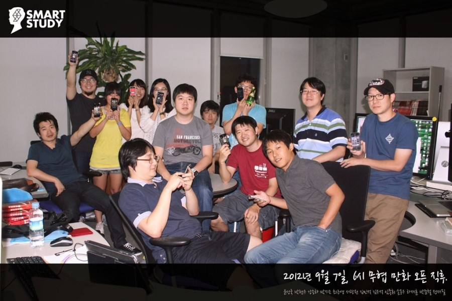

