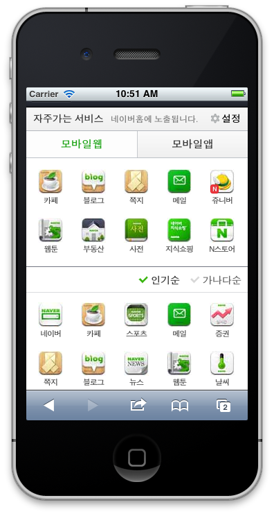
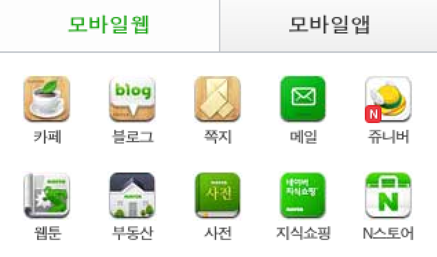

Title: 네이버 모바일 아이콘, 33KB의 얼굴.
Time: 21:43:00

어느 날 문득, 네이버 아이콘들이 어쩐지 지저분해보였다.

확대해보면 아래와 같이 저화질 JPG 의 특색을 보인다. 아마도 CSS로 쓸 이미지의 용량을 과도하게 줄이다보니 그런 것 같다.

  

  

CSS 스프라이트 이미지를 까보니 아래와 같다. 약 33KB의 이미지.

  

  

  

  

첫 페이지에 나오는 아이콘에 대한 비중이 줄어들면서, 그냥 별 신경 안 쓰고 있는 것 같은데,

아이콘은 서비스의 얼굴 아닌가? 꽤나 대충 한다는 생각이 드네.

  

  

  

