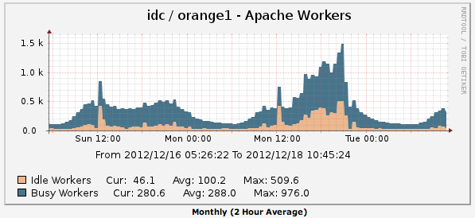
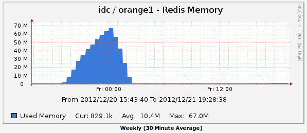
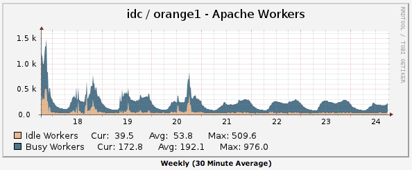
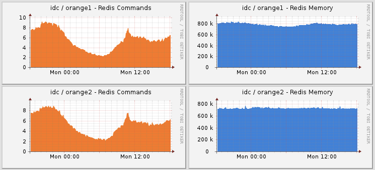

Title: Redis를 이용해 SQL INSERT 명령 배치 처리하기
Time: 18:14:00

Preface

모바일 앱에 푸시 메세지를 보내기 위해서는, 푸시를 발송할 서버에서 미리 device token 또는 registrationId를(이하 모두
토큰)수집해야 한다.

APNS : [http://developer.apple.com/library/mac/#documentation/NetworkingIntern
et/Conceptual/RemoteNotificationsPG/ApplePushService/ApplePushService.html](ht
tp://developer.apple.com/library/mac/#documentation/NetworkingInternet/Concept
ual/RemoteNotificationsPG/ApplePushService/ApplePushService.html)

GCM : [http://developer.android.com/google/gcm/gcm.html](http://developer.andr
oid.com/google/gcm/gcm.html)

사내에서 운영중인 푸시 서버는 InnoDB에 이러한 정보를 보관하고 있는데, 설치된 앱 당 하나의 Row을 가지게 하기 위해, 토큰
값과Application ID를 결합하여 unique key 로 지정해, 하나의 앱에 여러 번의 푸시 메세지가 전달되지 않도록 하고 있다.
별도의 가입형 회원제 서비스를 하고 있지 않는 앱이 많다보니 생긴 특징이라 할 수 있다.

과거에는 다음과 같은 절차로 서버에 푸시 정보를 보관하고 있었다.

1. 앱이 실행된다.

2. 앱이 직접 APNS 또는 GCM 서버에 요청해 토큰을 얻는다.

3. 토큰을 서버로 보낸다.

일반적인 경우에 큰 문제가 되는 솔루션은 아니지만, 대량으로 푸시를 전송하는 경우에 다음과 같은 문제가 발생한다.

1. 푸시를 대량으로 보낸다.

2. 앱이 동시에 엄청나게 실행된다.

3. InnoDB에 업데이트 명령어들이 무자비하게 실행되어, 커넥션이 터져나간다.

Solution

토큰을 업데이트하는 코드가 php로 작성되어 있는데, 이 소스가 Apache HTTPD의 mpm_prefork + mod_php5 에 의해
실행되고 있어 이래저래 큰 문제가 되어 왔다.

총 토큰의 수가 적을 때에는 크게 문제되지 않았는데, 그 숫자가 천만 단위가 넘으니 해당 테이블을 사용할 때 퍼포먼스가 굉장히 떨어져,
MySQL 커넥션 뿐 아니라 아파치 커넥션도 넘치게 되었다.

이 문제를 해결하기 위해서,

1. 클라이언트 코드를 수정하여, 토큰이나 기타 정보가 업데이트 되지 않은 경우 보고 않도록 수정하거나,

2. 토큰 수집 서버를 수정 해야 하는데,

3. 클라이언트를 모두 강제로 업그레이드 시킬 수는 없으므로 일단 서버 코드를 수정하여 문제를 해결하기로 했다.

예전에 MongoDB 문제를 해결했던 것([http://blog.naver.com/ez_/140158788246](http://blog.na
ver.com/ez_/140158788246))과 같은 맥락에서 이번에도,

1. 일단 Redis를 투입한다(...)

2.토큰 업데이트 요청이 서버에 들어오면 바로 업데이트 하지 않고, 업데이트 할 내용을 serialize하여 Redis 리스트에 밀어넣은
다음, crontab에 의해 주기적으로 호출되는 프로그램이 일정량을 리스트에서 긁어와, unserialize 하여 한꺼번에 업데이트 하도록
하였다.

기존에 InnoDB에 토큰을 업데이트 하는 구문은 아래와 같았는데 (하나씩 업데이트),

INSERT INTO `tablename` VALUES (...) ON DUPLICATE KEY UPDATE `col1` = `val1`,
`col2` = `val2`...

이를 다음과 같이 변경하여 여러 값을 동시에 변경할 수 있도록 하였다.

INSERT INTO `tablename` VALUES (...), (...), ... ON DUPLICATE KEY UPDATE
`col1` = VALUES(`col1`), `col2` = VALUES(`col2`), ...

기존 방식으로 서비스하던 때에는 위의 그래프와 같이 worker가 1,500개를 넘어 서비스 장애의 수준까지 갔었다.

물론 당장 쓰레드 모델로 변경하면 접속을 더 확보할 수도 있지만 여전히 MySQL쪽의 커넥션 제한과 퍼포먼스 문제는 남는다.

  

2012-12-20일 저녁에 일단 Redis 리스트에 토큰 정보를 넣도록 수정하여 패치한 이후에, 메모리가 늘어가는 모습을 보며 (=서버가
서서히 죽어가는 모습을 보며) Redis -> InnoDB 벌크 인서트 프로그램을 작성해 밤 12시에 다시 패치하여 Redis로 인해 서버
메모리가 터지지 않도록 하였다. (...)

20일 이전에 푸시를 대량 전송하면 급격히 올라가던 worker 수가 패치가 적용된 20일 이후 안정적인 모습을 보이고 있다.

현재는 각 서버당 < 1M의 메모리만을 사용하며 안정적으로 운용중이다.

