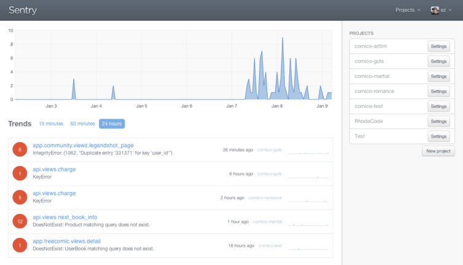
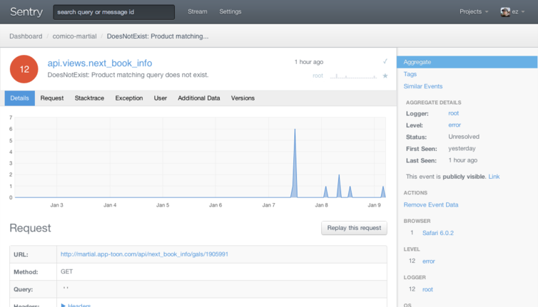
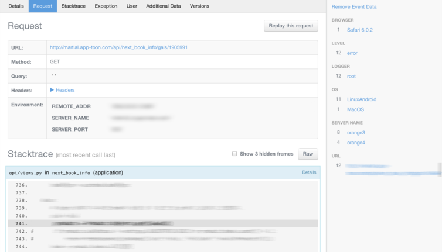
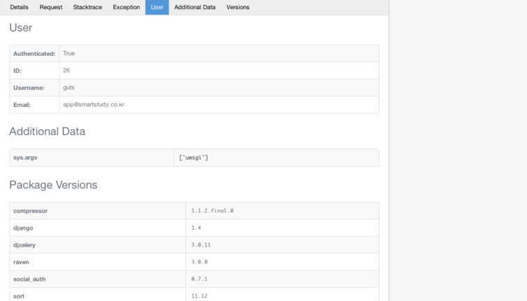
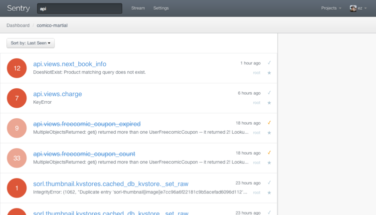
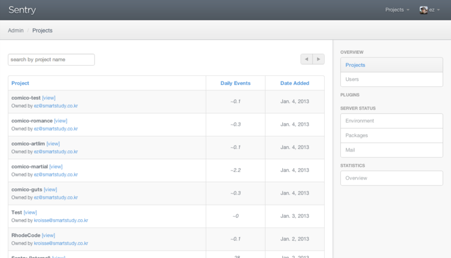
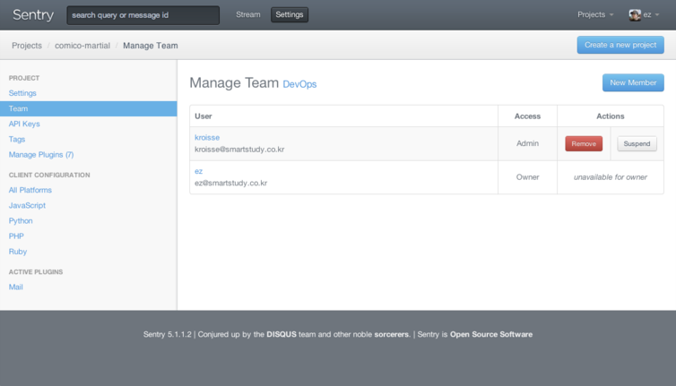

Title: Django with Sentry
Time: 21:24:00

Sentry

[https://getsentry.com/](https://getsentry.com/)

> Exceptional error aggregation.

>

> Streamline app maintenance and debugging inreal-time with Sentry.

Sentry는 위와 같이 스스로를 정의하고 있는,Django 기반의에러/로그 수집기이다.

내장된 TCP/UDP 서버로 동작하며, Python, PHP, Ruby, Node.js, Java 등의 에러와 로그를 수집할 수 있다.

특히, 잘 알려진 웹 프레임워크인 Django, Flask, Rails, Express 등과 복잡한 설정 없이 잘 달라붙어 효과적인 에러
수집과 분석이 가능한 것이 강점이다.

BSD 라이센스로 공개되어 있어
[https://github.com/getsentry/sentry](https://github.com/getsentry/sentry) 를
통해 직접 내려받아 설치해서 운용할 수도 있고,

설치가 귀찮은 경우
[https://www.getsentry.com/pricing/](https://www.getsentry.com/pricing/)을 통해
호스팅으로 운용할 수 있는 것도 장점이다.

설치는[http://sentry.readthedocs.org/en/latest/quickstart/index.html](http://sent
ry.readthedocs.org/en/latest/quickstart/index.html) 를 참고하여 손쉽게 진행할 수 있으므로
생략한다.

  

  

Sentry in SMARTSTUDY

서비스하는 앱이 하이브리드 형태라 각종 페이지가 Django로 구축되어 있는데, 이들 서비스의 에러 로그를 수집하는데 사용하고 있다.

아래는 설치하여 사용하고 있는 Sentry의 스크린샷이다.

설정이 끝난 Sentry의 첫 화면이다. html canvas를 이용한 로그 수집 양에 대한 그래프와 함께, 지난 24시간 동안 보고된
에러를 종류 별로 구분하여 보여주고 있다.

에러를 하나 선택하면, 해당 에러에 대한 HTTP Request 정보를 보여준다.

문제를 일으킨 상황을 다시 재연(replay this request)할 수 있어 문제 해결에 도움이 된다.

해당 문제를 발생시킨 소스 스택과 요청 값에 대한 상세한 내용과 함께, 브라우저 / 서버 / URL / 사용자별 통계를 같이 보여준다.

위에서 언급했던 웹 프레임워크에 대해서는 사용자 정보 등 자세한 정보를 포함해서 더 용이한 분석을 도와준다.

해결된 에러에 대해서는 체크 버튼을 눌러 해당 이슈가 처리되었음을 표시할 수 있다.

Stream 페이지는 리스트를 지속적으로 폴링하여, 에러가 발생한 경우 준 실시간급으로 업데이트되는 것이 인상적이다.

  

프로젝트와 사용자 / 팀 관리 메뉴를 갖추고 있으며, LDAP 로그인, Gravatar 등을 지원한다.

애초에 Django 기반인데다, 자체적인 Sentry plugin 시스템도 제공하여 필요한 기능을 손쉽게 확장할 수 있다.

[http://sentry.readthedocs.org/en/latest/plugins/index.html](http://sentry.rea
dthedocs.org/en/latest/plugins/index.html)

